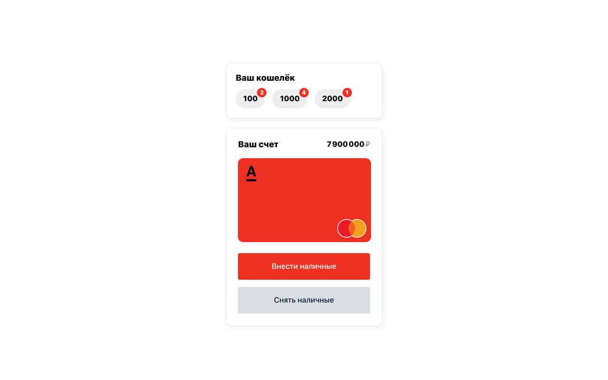

# Проект "Банкноты"

Данный проект можно потестить тут [https://banknotes.vercel.app](https://banknotes.vercel.app)
Этот проект сделан на быструю руку, поскольку времени на разработку было мало.

## Что можно добавить:

- Оптимизировать (вынести) функции, которые работают с лимитами банкнот на запись и на извлечение
- Добавить хранилище с транзакциями
- Хранить данные в localstorage

## Запускайте проект локально

1. Клонируйте репозиторий `git clone https://github.com/Alexsandrrh/banknotes.git`
2. Установите модули `npm install`
3. Запустите сборку проекта `npm run build`
4. И запустите проект локально `serve -s build`
